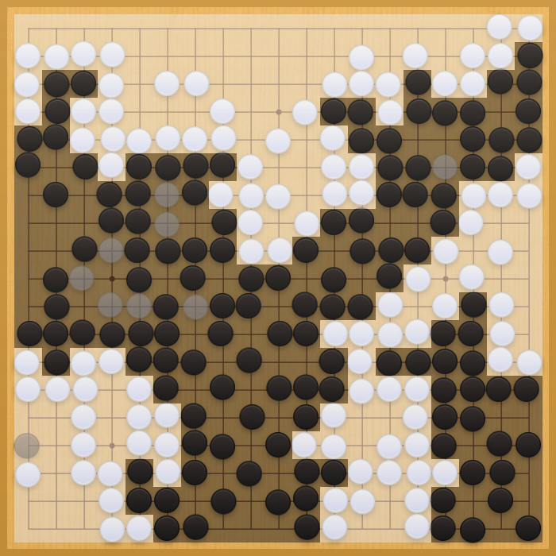

# KataJigo

Play against a KataGo that strives for a Jigo instead of opponent destruction.

Playing against [KataGo](https://github.com/lightvector/KataGo) can be
particularly frustrating. Even before midgame starts, KataGo may have
accumulated an overwhelming lead in points in the best case, or the game can
turn into a merciless, bloody slaughter of your groups in the worst case,
leading to your inevitable demise, leaving you sad and empty inside.

KataJigo is an experiment. It will let KataGo always aim for a half point win,
or a draw if playing with an integer komi, slipping into the role of a capable
teacher who's looking down from far above, playing a teaching game (in theory,
at least).



## Installation

1. Download both [KataGo](https://github.com/lightvector/KataGo) and
   [KataJigo](https://github.com/yishn/KataJigo/releases/latest).
2. Install and set up KataGo according to the instructions.
3. In the same folder as KataGo, drop in the executable of KataJigo.
4. Now, you can use `katajigo` as a drop-in replacement of `katago`.

If you already set up KataGo in Sabaki, all you need to do is replace the path
to KataGo with the path to KataJigo in the same directory.

## Building

Make sure you have Node.js installed. First, clone the repository and install
all dependencies with npm:

```
$ git clone https://github.com/yishn/KataJigo
$ cd KataJigo
$ npm install
```

Run the following command to create an executable in the `./bin` directory:

```
$ npm run build
```
